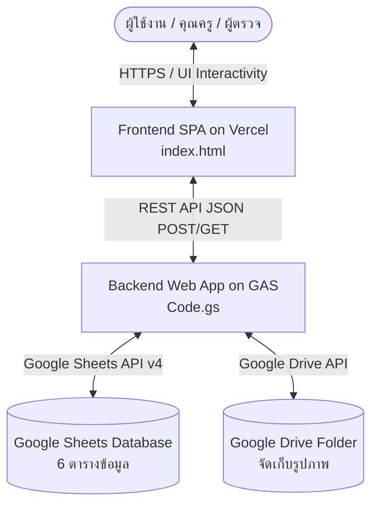

# 🤖 AGENTS.md: คู่มือสถาปัตยกรรมและแนวทางการพัฒนาระบบ (System Architecture & Agent Guidelines)

> **ชื่อโปรเจกต์:** ระบบตรวจสอบความสะอาดห้องเรียนและเขตพื้นที่รับผิดชอบ  
> **หน่วยงาน:** โรงเรียนประชาสงเคราะห์วิทยา  
> **เวอร์ชัน:** 3.0 (Full-Stack SPA + Google Apps Script + Sheets API v4)  
> **Repository:** `https://github.com/pcskschool/pcsk-checkclassroom.git`

---

## 1. ภาพรวมระบบ (System Overview)

ระบบเว็บแอปพลิเคชันแบบ **Single Page Application (SPA)** สำหรับประเมินและบันทึกคะแนนความสะอาดของห้องเรียนและเขตพื้นที่บริการประจำวัน พร้อมระบบอัปโหลดและบีบอัดรูปภาพ, ตารางสรุปผล Real-time, ระบบกักเก็บข้อมูลภาพบน Google Drive และการควบคุมสิทธิ์ผ่านรหัส PIN 6 หลัก



---

## 2. ข้อมูลจำเพาะทางเทคนิค (Tech Stack Specs)

| ส่วนประกอบ | เทคโนโลยี / เครื่องมือ | รายละเอียด |
| :--- | :--- | :--- |
| **Frontend Hosting** | Vercel (Hobby Tier) | Static Site Deployment ผ่าน GitHub Repository |
| **UI Framework & Styles** | Tailwind CSS v3 (CDN) + Vanilla JS (ES6+) | Mobile-first Responsive, Modern Design Palette |
| **Typography** | Google Fonts | Noto Sans Thai (Weights 300, 400, 500, 600, 700) |
| **Modal & Alerts** | SweetAlert2 v11 | Custom Mixin, Loading, Error, Toast Feedback |
| **Lightbox Gallery** | Fancybox 5 (CDN) | ดูภาพเต็ม, ซูมเข้า-ออก, สไลด์โชว์, ดาวน์โหลดรูป |
| **Client Image Resizer** | HTML5 Canvas API | บีบอัดภาพ Max 1024px, JPEG Quality 0.78 |
| **Backend Runtime** | Google Apps Script (GAS) | REST API Web App (doGet / doPost), LockService |
| **Database** | Google Sheets API v4 | Sheet ID: `1eVa3TkkXrwDLPyPWpo1Ux4qtvJeOfzkTz5yU11QO92M` |
| **File Storage** | Google Drive API | Folder ID: `1XpX-SdJ5Gw-Evd0PBsVPmoisIKzxuU_u` |

---

## 3. โครงสร้างไฟล์และหน้าที่รับผิดชอบ (File Structure)

```
PCSK-CheckClassroom V3/
├── Code.gs          # Backend API, Sheets API v4 Engine, Drive Uploader & Automations
├── index.html       # Frontend SPA, State Management, Responsive UI & Lightbox Gallery
└── AGENTS.md        # คู่มือและเอกสารทางสถาปัตยกรรมสำหรับนักพัฒนาและ AI Agents
```

---

## 4. โครงสร้างฐานข้อมูล Google Sheets (Database Schema)

### 4.1 `SETTING` (การตั้งค่าระบบ)
* **Headers:** `Key` | `Value` | `Description`
* **ตัวอย่างข้อมูล:**
  * `school_name`: โรงเรียนประชาสงเคราะห์วิทยา
  * `school_logo`: URL รูปภาพโลโก้โรงเรียน
  * `system_announcement`: ข้อความประกาศบนแถบแบนเนอร์ (ซ่อนอัตโนมัติหากเป็นค่าว่าง)
  * `enable_room_check`: `TRUE` / `FALSE`
  * `enable_area_check`: `TRUE` / `FALSE`
  * `academic_term`: `1/2569`
  * `auto_delete_days`: จำนวนวันลบรูปภาพใน Drive อัตโนมัติ (`0` = ปิดใช้งาน)

### 4.2 `USERS` (ข้อมูลผู้ใช้งานและสิทธิ์)
* **Headers:** `user_id` | `full_name` | `pin` | `role` | `allowed_rooms` | `allowed_areas` | `is_active`
* **Roles:** `teacher` (เข้าถึงได้ทุกเมนูรวมถึงแท็บตั้งค่า), `Inspector` (เข้าถึงเฉพาะเมนูตรวจความสะอาด)
* **Allowed Format:** `'all'` หรือ Array เช่น `['ม.1/1', 'ม.1/2']`

### 4.3 `DB_classroom` (ฐานข้อมูลห้องเรียน)
* **Headers:** `classroom` | `area_id` | `advisors`
* **ตัวอย่าง:** `ม.1/1` | `AREA001` | `['ครูผกามาศ เสือคล้าย', 'ครูอุเทน หมื่นสุวรรณ์']`

### 4.4 `DB_allArea` (ฐานข้อมูลเขตพื้นที่รับผิดชอบ)
* **Headers:** `area_id` | `area_name` | `area_description` | `is_active`
* **ตัวอย่าง:** `AREA001` | `หน้าเสาธง` | `บริเวณหน้าเสาธงทั้งหมดและทางเดินด้านหน้า` | `TRUE`

### 4.5 `LIST_allChecklist` (รายการเกณฑ์การให้คะแนน)
* **Headers:** `checklist_id` | `checklist_name` | `checklist_detail` | `max_score` | `is_active`
* **การจำแนกประเภท:** 
  * รหัสขึ้นต้นด้วย `room...` = รายการตรวจห้องเรียน
  * รหัสขึ้นต้นด้วย `area...` = รายการตรวจเขตพื้นที่

### 4.6 `LOG_inspections` (บันทึกประวัติการตรวจ)
* **Headers:** `record_id` | `timestamp` | `date_str` | `type` | `target_id` | `target_name` | `inspector_name` | `scores_json` | `total_score` | `max_score` | `percentage` | `comment` | `image_urls_json` | `term`

---

## 5. กฎทางธุรกิจและตรรกะสำคัญ (Core Business Logic)

### 5.1 ตรรกะการบันทึกทับข้อมูลใน 1 วัน (Daily Single-Record Upsert)
* ใน 1 วัน แต่ละห้องเรียนและเขตพื้นที่จะมีบันทึกในชีต `LOG_inspections` **ได้เพียง 1 แถวเท่านั้น**
* เมื่อมีการส่งผลการตรวจเข้ามา Backend จะค้นหาในชีต `LOG_inspections` โดยเทียบ:
  1. `date_str` = วันที่ปัจจุบัน (`YYYY-MM-DD`)
  2. `target_id` = รหัสห้องเรียน หรือ เขตพื้นที่
* **หากพบข้อมูลเดิม:** ทำการ **บันทึกทับ (Overwrite/Update)** แถวเดิมทันที พร้อมลบรูปภาพชุดเก่าใน Drive เพื่อประหยัดพื้นที่
* **หากไม่พบข้อมูลเดิม:** ทำการ **เพิ่มแถวใหม่ (Append Row)**

### 5.2 การประมวลผลรูปภาพ (Image Processing Pipeline)
1. **Client-Side (HTML5 Canvas):** บีบอัดรูปภาพก่อนส่ง ขนาดด้านยาวสุดไม่เกิน **1024px**, Aspect Ratio คงเดิม, Quality **0.78 JPEG** (แนบได้สูงสุด 5 รูป)
2. **Backend Storage:** ถอดรหัส Base64 สร้างไฟล์ลง Google Drive Folder พร้อมระบบครอบ `try...catch` ป้องกันข้อจำกัดสิทธิ์แชร์สาธารณะขององค์กร (Google Workspace Safe Sharing)
3. **URL Mapping:** สร้าง Direct Link `https://lh3.googleusercontent.com/d/{fileId}` สำหรับแสดงผลบน Lightbox Fancybox 5 ได้อย่างรวดเร็ว

### 5.3 ระดับคะแนนและการแสดงผล (Score Badges)
* 🟢 **สีเขียว (ยอดเยี่ยม):** คะแนน $\ge 80\%$
* 🔵 **สีน้ำเงิน (ดี):** คะแนน $65\% - 79\%$
* 🟠 **สีส้ม (พอใช้):** คะแนน $50\% - 64\%$
* 🔴 **สีแดง (ควรปรับปรุง):** คะแนน $< 50\%$
* ⚪ **สีเทา:** ยังไม่ได้ตรวจ

---

## 6. คำแนะนำสำหรับ AI Agents ในการแก้ไข/พัฒนาต่อยอด

1. **การอ่านข้อมูลชีต:** ต้องเรียกใช้ฟังก์ชันกลาง `getDataByHeaderAPI()` ใน `Code.gs` เสมอ เพื่อความรวดเร็วผ่าน Google Sheets API v4
2. **การคงสภาพ UI Response:** ใน `index.html` ต้องรักษาโครงสร้าง **Initial Skeleton Loader** ไว้ในแท็ก HTML เสมอ เพื่อป้องกันปัญหาหน้าจอขาวว่างเปล่าระหว่างรอ API Cold Start
3. **การจัดการ Session:** ข้อมูลการเข้าสู่ระบบถูกเก็บใน `sessionStorage` ภายใต้คีย์ `pcsk_user_session`
4. **ความปลอดภัยของ PIN:** Backend จะไม่ส่งค่า PIN กลับมาใน API Response (`getInitialData` หรือ `verifyPin`) โดยเด็ดขาด
5. **การ Deploy บน Vercel:** เมื่อแก้ไขโค้ดใน `index.html` ให้ทำ Git Commit และ Push ไปยัง Branch `main` ของ GitHub Repository Vercel จะ Auto-Build & Deploy ทันที

---

*เอกสารฉบับนี้สร้างขึ้นเพื่อเป็นมาตรฐานการดูแลรักษาและพัฒนาต่อยอดระบบอย่างยั่งยืน*
